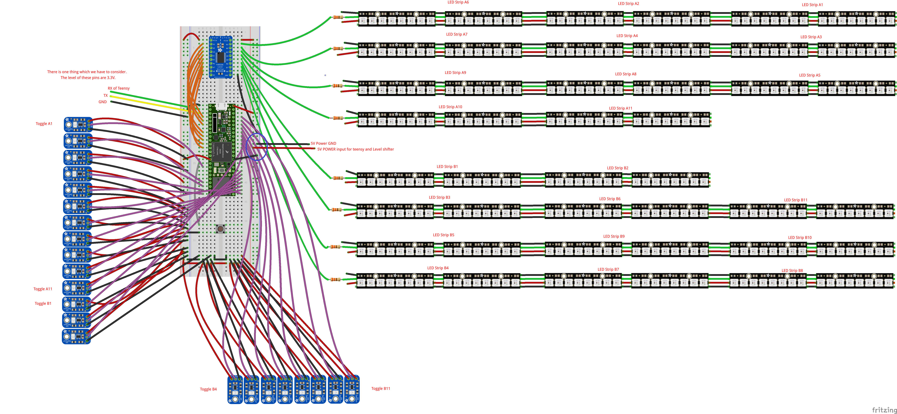

# 🎨 ESP32/Teensy NeoPixel Breathing LED Controller

> **Interactive LED Installation Controller** with beautiful breathing animations, sensor triggers, and video synchronization.

A sophisticated embedded systems project featuring a finite state machine-based LED controller with 22 interactive sensors, smooth animations, and video player integration.

---

## ✨ Features

### 🎭 State Machine Architecture
- **Standby** → Sleep state with LEDs off
- **Standby2Active** → 2-second breathing fade-in animation
- **Active** → Ready state with all LEDs bright
- **Active2Trigger** → 1-second dramatic spotlight transition
- **Triggered** → Video playback with spotlight effect
- **Trigger2Active** → 1-second recovery fade-out
- **Active2Standby** → 2-second breathing fade-out animation

### 💡 Interactive Features
- **22 Light Sensors** - Touch/motion triggers for interactive response
- **Beautiful Breathing Effects** - Smooth HSV color transitions
- **Spotlight Mode** - Focuses 3 predetermined LED strips per trigger
- **Video Synchronization** - Controls external video player via serial
- **Auto-Sleep** - 60-second inactivity timeout
- **Debouncing** - PLC-style industrial-grade input filtering

### 🔌 Hardware Support
- **ESP32** or **Teensy 3.6** microcontroller
- **22 NeoPixel LED Strips** (WS2812B compatible)
- **8 parallel data pins** for high-speed LED control
- **22 interactive sensor inputs** (light sensors, buttons, etc.)
- **Serial video player integration**

### ⚡ Technical Highlights
- **40 FPS smooth animations** (25ms update interval)
- **PLC-style function blocks** (TON, TP, Rising/Falling triggers)
- **Method-chaining FSM** for clean state transitions
- **Memory-efficient** struct-based design
- **Deterministic timing** using Arduino millis()

---

## 📋 Project Structure

```
.
├── teensy-neopixel-breathing.ino    # Main application
├── FiniteStateMachine.h             # FSM class definition
├── FiniteStateMachine.cpp           # FSM implementation
├── FBD.h                            # PLC function blocks (TON, TP, Rtrg, Ftrg)
├── README.md                        # This file
└── WiringDiagram.png               # Hardware wiring diagram
```

### Key Files Explained

**`teensy-neopixel-breathing.ino`** (582 lines)
- Main application loop and state machine
- Sensor input processing with debouncing
- LED animation functions for each state
- Video player serial protocol implementation

**`FiniteStateMachine.h/cpp`** (Alexander Brevig - MIT License)
- Professional state machine implementation
- Supports enter/update/exit callbacks per state
- State query methods and timing tracking
- Method chaining for clean code

**`FBD.h`** (Function Block Diagram)
- IEC 61131-3 standard function blocks
- **TON** (Timer On-Delay) - Debounce inputs
- **TP** (Timer Pulse) - Cooldown timers
- **Rtrg** (Rising Trigger) - Edge detection (0→1)
- **Ftrg** (Falling Trigger) - Edge detection (1→0)

---

## 🚀 Getting Started

### Hardware Requirements
- Microcontroller: Teensy 3.6 or ESP32
- 22× NeoPixel LED strips (WS2812B, 16 LEDs per strip)
- 1× Power button (19mm illuminated switch)
- 22× Light sensor modules (IR or similar)
- Power supply: 5V, 10A+ recommended
- Serial video player (optional, for video features)

### Installation

1. **Clone Repository**
   ```bash
   git clone https://github.com/drone0219/esp32-neopixel-breathing.git
   cd esp32-neopixel-breathing
   ```

2. **Install Dependencies**
   - Arduino IDE or PlatformIO
   - FastLED library: `#include <FastLED.h>`
   - TimeLib library: `#include <TimeLib.h>`

3. **Configure Hardware Pins**
   Edit pin definitions in the main `.ino` file:
   ```cpp
   #define NUM_STRIPS 22              // Number of LED strips
   const uint8_t POWERBUTTON = 24;    // Power button pin
   const uint8_t Toggles[] = {...};   // Sensor pins array
   const uint8_t Strip1 = 2;          // LED data pins
   ```

4. **Upload to Device**
   - Select board: Teensy 3.6 or ESP32
   - Select COM port
   - Upload sketch

5. **Wire Hardware**
   See `WiringDiagram.png` for complete connection details

---

## 🎮 Operation

### States and Transitions

```
┌─────────────────────────────────────────────────────────┐
│                   STATE MACHINE FLOW                     │
└─────────────────────────────────────────────────────────┘

                    Power Button
    ┌──────────────────────────────┐
    │                              ▼
┌──────────┐  2s fade  ┌─────────────────┐  2s fade  ┌──────────┐
│ STANDBY  │──────────►│ Standby2Active  │──────────►│  ACTIVE  │
│🌙 Off    │           │🌅 Breathing In  │           │✨ Bright │
└──────────┘           └─────────────────┘           └──────────┘
    ▲                                                    │  │
    │                                                    │  │ Sensor
    │                ┌──────────────────┐                │  │ Trigger
    │                │ Active2Standby   │                │  │
    └────────────────│🌆 Breathing Out  │◄───────────────┤  │
      60s timeout    │  (2 seconds)     │                │  │
                     └──────────────────┘                │  │
                                                         │  │
                     ┌──────────────────┐  1s fade       │  │
                     │ Active2Trigger   │                │  │
                     │🎯 Spotlight Fade │◄───────────────┘  │
                     └──────────────────┘                    │
                              │ 1s                           │
                              ▼                              │
                     ┌──────────────────┐                    │
                     │   TRIGGERED      │◄───────────────────┘
                     │🎬 Video Playing  │
                     │   15s hold       │
                     └──────────────────┘
                              │
                              │ Sensor cleared
                              │ or 45s timeout
                              ▼
                     ┌──────────────────┐
                     │ Trigger2Active   │
                     │🎯 Recovery Fade  │
                     │  (1 second)      │
                     └──────────────────┘
                              │ 1s
                              ▼ Back to ACTIVE
```

### User Interaction

1. **Power On** → Press power button
   - System wakes from Standby
   - All LEDs fade in over 2 seconds
   - System enters Active state, listening for triggers

2. **Trigger Event** → Wave hand near sensor
   - Sensor detects motion/light
   - 3 predetermined LED strips highlight (spotlight)
   - Video plays on external player
   - LEDs hold for 15 seconds

3. **Auto-Sleep** → No activity for 60 seconds
   - LEDs fade out smoothly
   - System returns to Standby
   - Waits for next power button press

---

## 🎨 Color Configuration

The project uses **HSV (Hue, Saturation, Value)** color space for smooth, intuitive color control.

**Current Color Settings:**
```cpp
#define HUE 42              // Hue: Yellow-green (~60° on color wheel)
#define SAT 45              // Saturation: Subtle, warm tone
#define STBYBRIGHTNESS 0    // Standby: LEDs completely off
#define ACTIVEBRIGHTNESS 255 // Active: Full brightness
```

**To change colors**, modify these values:
- **HUE** (0-255): 0=Red, 42=Yellow-Green, 96=Green, 160=Blue, 224=Magenta
- **SAT** (0-255): 0=White, 255=Pure color
- **Value (brightness)**: 0=Off, 255=Full

Example: Pure blue at 80% brightness
```cpp
#define HUE 160
#define SAT 255
#define ACTIVEBRIGHTNESS 204  // 255 * 0.8
```

---

## ⏱️ Timing Configuration

All timings are in **milliseconds** and can be adjusted:

```cpp
#define STBYTOACTIVETIME 2000      // Standby→Active fade: 2 seconds
#define ACTIVETOSTBYTIME 2000      // Active→Standby fade: 2 seconds
#define ACTIVETOTRIGTIME 1000      // Active→Trigger fade: 1 second
#define TRIGTOACTIVETIME 1000      // Trigger→Active fade: 1 second
#define TRIGGERHOLDINGTIME 15000   // Hold spotlight: 15 seconds
#define TRIGGERIGNORETIME 30000    // Cooldown between triggers: 30 seconds
#define DEBOUNCE 200               // Input debounce: 200ms
```

---

## 🔌 Hardware Pins

### Microcontroller Pins
- **Power Button**: Pin 24 (INPUT_PULLUP, active LOW)
- **LED Data Pins**: 2, 3, 4, 6, 7, 8, 9, 10 (OUTPUT)
- **Sensor Pins**: 25, 29, 30, 31, 32, 33, 34, 35, 36, 37, 38, 39, 14, 15, 16, 17, 18, 19, 20, 21, 22, 23 (INPUT_PULLUP, active LOW)

### Serial Interfaces
- **Debug Console**: Serial (USB) at 115200 baud
- **Video Player**: Serial1 (hardware UART) at 115200 baud

---

## 📡 Video Player Protocol

Commands are sent to an external video player via Serial1:

**Packet Format (6 bytes):**
```
[0x00]  0xFF        Start marker
[0x01]  0xAA        Header
[0x02]  0x01        Data length (always 1)
[0x03]  Video ID    1-22 for content, 0=Stop, 23=Pause, 25=Stop
[0x04]  Checksum    (length + video_id) % 100
[0x05]  0xFE        End marker
```

**Example:** Play video 5
```
0xFF 0xAA 0x01 0x05 0x06 0xFE
```

---

## 🛠️ Advanced Configuration

### LED Strip Mapping
Each of the 22 physical strips is mapped to a position in the LED buffer:

```cpp
const uint16_t STRIP_A1 = 33;    // Strip A1 starts at buffer index 33
const uint16_t STRIP_A2 = 17;    // Strip A2 starts at buffer index 17
// ... etc
const uint16_t STRIP_PTR[23] = { // Lookup table for fast access
  STRIP_A1, STRIP_A2, ..., STRIP_B11, STRIP_NONE
};
```

### Trigger Mapping
Each of the 22 sensors can trigger 3 predetermined LED strips:

```cpp
const uint16_t PreDetermine[NUM_TRIGGERS][3] = {
  { STRIP_A6, STRIP_A9, STRIP_A5 },  // Trigger 0 lights up strips A6, A9, A5
  { STRIP_NONE, STRIP_NONE, STRIP_NONE },  // Trigger 1 inactive
  // ... etc
};
```

To modify which strips light up for each trigger, edit the `PreDetermine` array.

---

## 📊 PLC Function Blocks Reference

### TON (Timer On-Delay)
Delays turning ON. Used for debouncing:
```cpp
TON timer;
timer.PT = 200;        // 200ms delay
timer.IN = signal;
TONFunc(&timer);
if (timer.Q) {
  // Signal has been stable HIGH for 200ms
}
```

### TP (Timer Pulse)
Generates fixed-duration pulse. Used for cooldowns:
```cpp
TP cooldown;
cooldown.PT = 30000;   // 30-second pulse
cooldown.IN = trigger;
TPFunc(&cooldown);
if (!cooldown.Q) {
  // 30 seconds have elapsed, ready for next trigger
}
```

### Rtrg (Rising Trigger)
Detects 0→1 transition:
```cpp
Rtrg edge;
edge.IN = signal;
RTrgFunc(&edge);
if (edge.Q) {
  // Signal just went LOW→HIGH (one cycle only)
}
```

### Ftrg (Falling Trigger)
Detects 1→0 transition:
```cpp
Ftrg edge;
edge.IN = signal;
FTrgFunc(&edge);
if (edge.Q) {
  // Signal just went HIGH→LOW (one cycle only)
}
```

---

## 🐛 Troubleshooting

### LEDs Not Responding
- **Check power**: 5V supply must be stable and have sufficient current
- **Check data pins**: Ensure FastLED.addLeds() matches your pin configuration
- **Check wiring**: Data line, ground, and 5V must be properly connected

### Sensors Not Triggering
- **Check debounce time**: May be too long, sensor pulse too short
- **Check pin configuration**: Verify sensor pins in Toggles[] array
- **Check polarity**: Sensors should pull pin LOW when triggered

### Video Not Playing
- **Check serial connection**: Verify Serial1 baud rate (115200)
- **Check protocol**: Ensure video player expects the correct packet format
- **Check indexing**: Video IDs should match player's content library

### State Transitions Delayed
- **Check timing values**: Verify STBYTOACTIVETIME, etc. are appropriate
- **Check loop speed**: Ensure loop executes frequently (no blocking calls)
- **Check FSM updates**: stateMachine.update() must be called every loop

---

## 📚 Libraries Used

| Library | Version | Purpose |
|---------|---------|---------|
| **FastLED** | Latest | High-performance NeoPixel control |
| **TimeLib** | Latest | Time management utilities |
| **Arduino/Teensy Core** | Latest | Microcontroller API |

---

## 📄 License & Attribution

**Finite State Machine Library**
- Author: Alexander Brevig
- License: MIT
- Original: https://github.com/alexanderbrevig/FiniteStateMachine

**Project**: MIT License
- Author: drone0219
- Repository: https://github.com/drone0219/esp32-neopixel-breathing

---

## 🤝 Contributing

Contributions welcome! Feel free to:
- Report bugs and issues
- Suggest new features
- Improve documentation
- Optimize performance
- Add support for additional hardware

---

## 📞 Support

For questions or issues:
1. Check the inline code comments (extensively documented!)
2. Review the troubleshooting section above
3. Examine the function block implementations in FBD.h
4. Check the state machine flow diagrams

---

## 🎓 Learning Resources

This project demonstrates:
- **Finite State Machines** - Clean architecture for complex behavior
- **PLC Function Blocks** - Industrial-grade timing and triggers
- **Embedded Systems** - Real-time LED control and sensors
- **Arduino Programming** - Hardware control best practices
- **HSV Color Space** - Intuitive color manipulation
- **Serial Communication** - Device integration and protocols

Perfect for learning advanced Arduino techniques!

---

# Wiring Diagram
